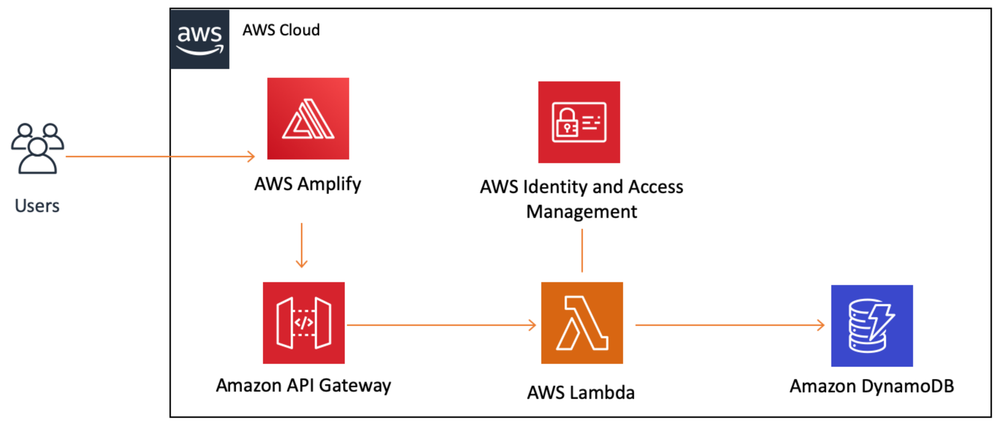

Thank you for sharing the corrected setup instructions. Here's the revised README file for your GitHub project, incorporating the provided instructions:

---

# PowerOfMath2

PowerOfMath2 is a simple web application that calculates the power of a number using AWS services.

## Project Overview

PowerOfMath2 ties together various AWS services to create an end-to-end web application. Users can input a base number and an exponent, and the application calculates the result using a Lambda function. The result is displayed on a hosted web page and stored in DynamoDB.

### Services Used

- **AWS Amplify**: Hosts the frontend web application.
- **AWS Lambda**: Executes Python code to calculate the power of numbers.
- **Amazon API Gateway**: Provides an HTTP endpoint to invoke the Lambda function.
- **Amazon DynamoDB**: Stores calculation results.
- **AWS Identity and Access Management (IAM)**: Manages permissions.

## Setup Instructions

### Prerequisites

- Text editor (e.g., Notepad++)
- AWS account with appropriate permissions
- Basic knowledge of AWS services

### Steps

1. **Create index.html**
   - Create a new HTML file named `index.html` in your preferred text editor.
   - Use the following content:

2. **Create Lambda Function**
   - Navigate to AWS Lambda in the AWS Management Console.
   - Create a new Lambda function named `PowerOfMathFunction2`.
   - Use Python 3.9 as the runtime.
   - Replace the default code with the code from `lambda_original.py` provided in this repository.
   - Deploy the Lambda function.

3. **Configure API Gateway**
   - Navigate to Amazon API Gateway in the AWS Management Console.
   - Create a new REST API named `PowerOfMathAPI2`.
   - Add a new POST method to your API.
   - Configure it to integrate with the `PowerOfMathFunction2` Lambda function.
   - Enable CORS for the POST method.
   - Deploy the API to a new stage named `dev`.

4. **Deploy Frontend with AWS Amplify**
   - Zip the `index.html` file.
   - Navigate to AWS Amplify in the AWS Management Console.
   - Create a new app named `PowerOfMath2`.
   - Deploy the app, providing the zipped `index.html` file.

5. **Test and Use**
   - Access the deployed frontend via the Amplify-provided URL.
   - Input base and exponent values, then click "Calculate" to see the result.

### Additional Notes

- Make sure to replace placeholders like `lambda_original.py` with your actual file names.
- For detailed instructions on setting up AWS services, refer to the AWS documentation or the provided links in the video.
